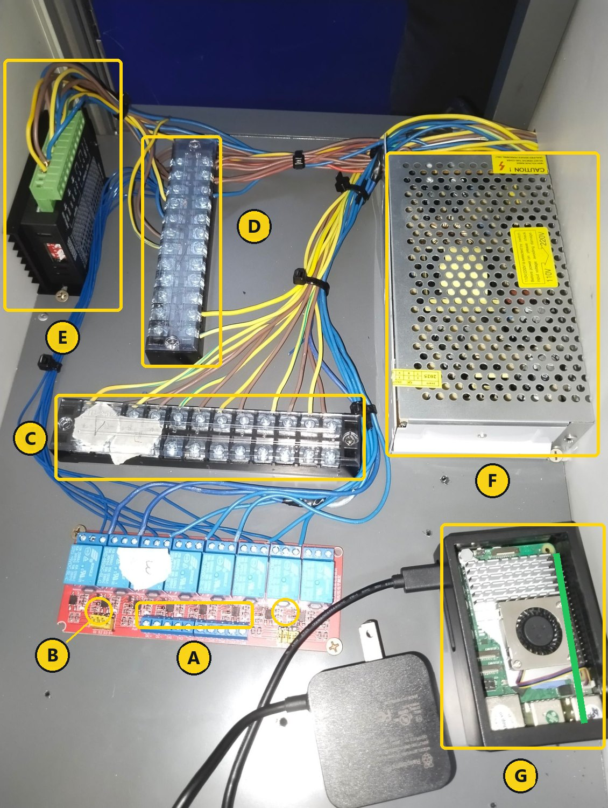
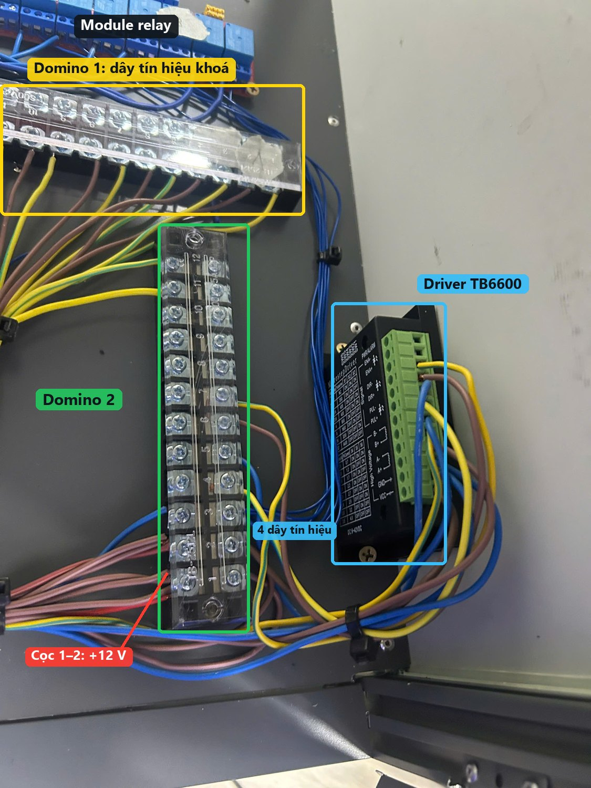
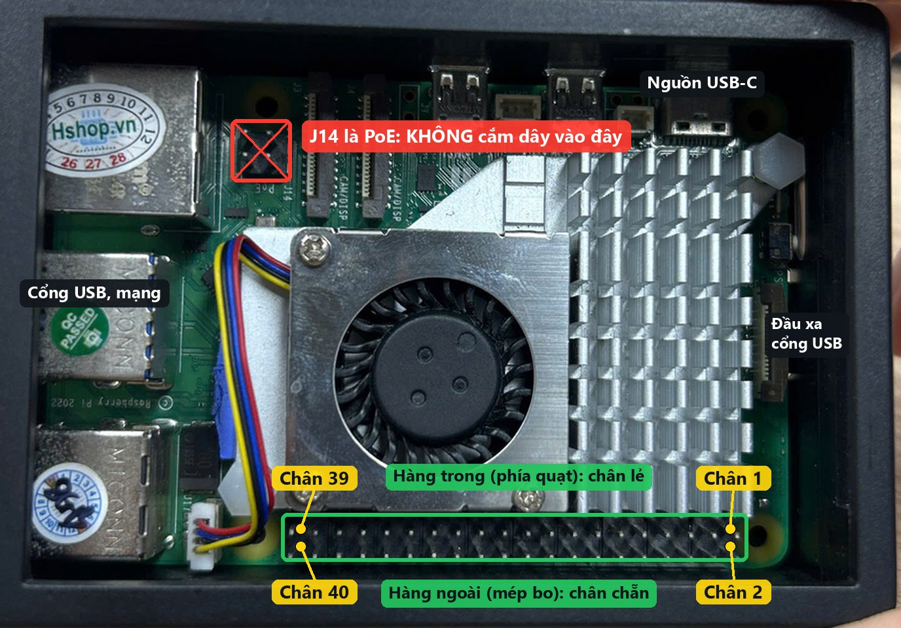
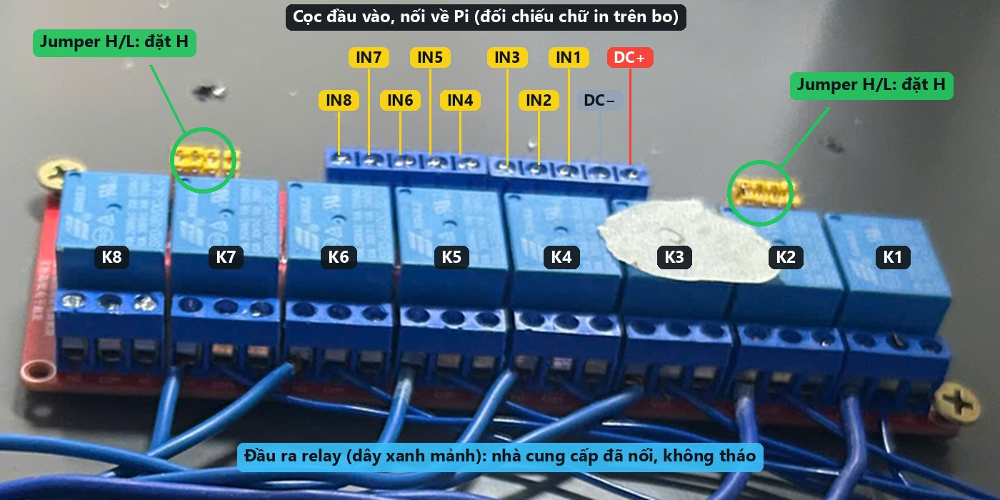
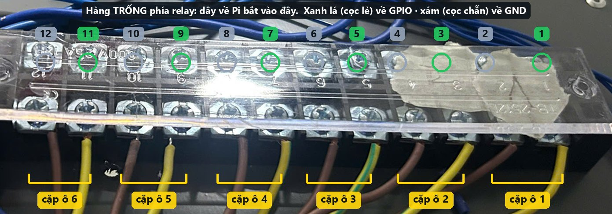
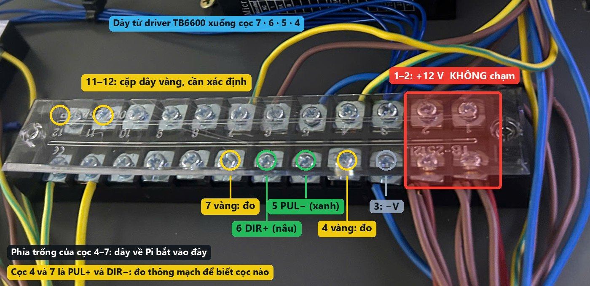
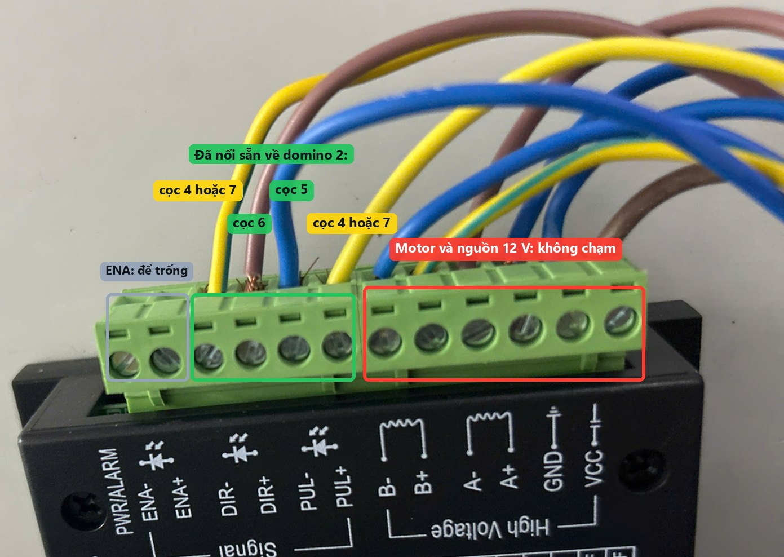
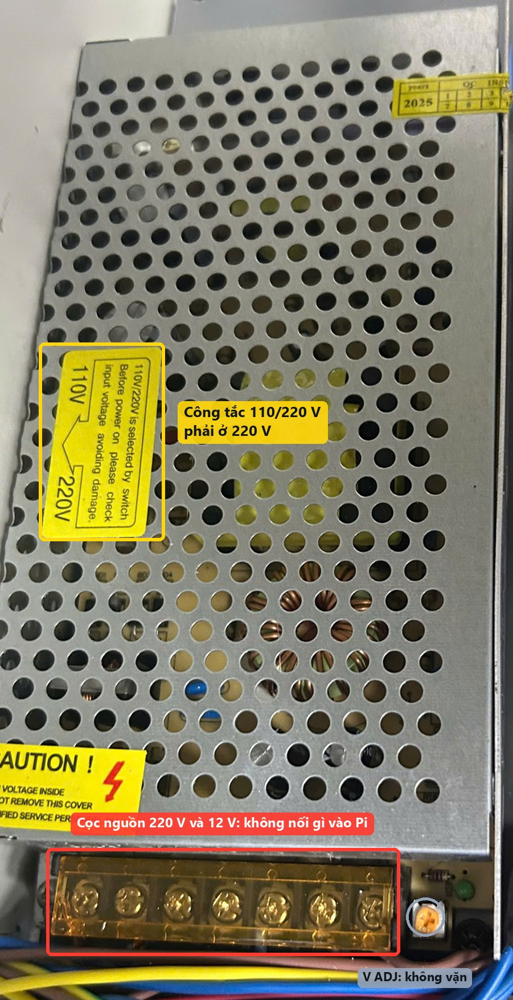

# Nối dây tủ `lockr-tu01` theo ảnh

| | |
|---|---|
| **Dùng khi** | Đang đứng trước khoang điện của tủ, cần biết dây nào bắt vào cọc nào |
| **Ảnh** | Ảnh gốc ở [`locker/`](../locker/) (toàn cảnh 2026-09-30, 12 ảnh chi tiết 2026-10-01). Ảnh có nhãn ở `img/tu01/`, sinh bằng `python scripts/annotate-tu01-photos.py` |
| **Bản đồ chân** | **Theo hướng dẫn của người làm tủ** (nhận 2026-10-01), khác mặc định trong code — [cabinet-wiring-spec § 6.1](cabinet-wiring-spec.md#61-tủ-lockr-tu01-chân-theo-người-làm-tủ). Pi đã đặt `.env` theo bản đồ này (§ 9) |
| **Quy trình đầy đủ** | [controller-wiring-guide § 3–5](controller-wiring-guide.md#3-thứ-tự-nối-dây) |
| **Gap** | F2-G09 |

Quy ước: **ô N** dùng relay `IN(N)` và là ô số N của tủ `CAB-TU01` trên admin (`slot = N − 1` trong code). Số chân Pi là **số chân vật lý** trên header 40 chân.

## 0. An toàn

- Rút phích 220 V của nguồn tổ ong trước khi động vào dây. Chỉ cắm lại ở bước đo và bước thử.
- Tắt Pi trước khi cắm hoặc rút dây ở header: bấm nút nguồn trên Pi hai lần liền, đợi đèn chuyển đỏ, rồi rút USB-C.
- Chân GPIO chỉ chịu **3,3 V**. Trên domino 2, cọc `+12 V` nằm cách cọc tín hiệu hai cọc. Một dây 12 V chạm vào chân GPIO là hỏng Pi.

## 1. Toàn cảnh khoang điện



| | Linh kiện | Việc phải làm |
|---|---|---|
| A | Cọc đầu vào của module relay (`DC+ DC− IN1…IN8`) | Nối 9 dây về Pi — § 3 |
| B | Hai cụm jumper vàng chọn mức kích | Đặt **H** — § 3 |
| C | **Domino 1** (TB-2512L, cạnh relay): 6 cặp dây tín hiệu khoá | Hàng phía relay còn trống, nối về Pi — § 4 |
| D | **Domino 2** (TB-2512L, cạnh driver): `+12 V`, `−V`, 4 dây tín hiệu driver, một cặp dây vàng | Nối 4 dây driver về Pi — § 5 |
| E | Driver TB6600 của nắp trượt | Không nối thẳng vào driver; đi qua domino 2 |
| F | Nguồn tổ ong 12 V | Kiểm công tắc 110/220 V — § 7 |
| G | Raspberry Pi 5, vệt xanh là header 40 chân | § 2 |



## 2. Pi: header 40 chân



- **Chân 1** ở đầu header **xa cổng USB**, hàng trong (phía quạt). **Chân 2** cùng vị trí, hàng ngoài (sát mép bo).
- Chân lẻ ở hàng trong, chân chẵn ở hàng ngoài. Chân *n* nằm ở cột thứ ⌈*n*/2⌉ tính từ đầu xa cổng USB.
- Header 2×2 **J14** cạnh cổng mạng là chân PoE. Không cắm dây điều khiển vào đó (đã cắm nhầm hai lần, sự cố 1 ở [hồ sơ Pi](pi-lockr-tu01.md#7-sự-cố-đã-gặp)).

## 3. Module relay — 9 dây



Ảnh chụp từ phía domino nên thứ tự cọc đầu vào đọc từ trái sang là `IN8 … IN1, DC−, DC+`. Nhìn từ phía Pi thì ngược lại. **Luôn đối chiếu chữ in trên bo cạnh từng cọc.**

1. Chuyển jumper của kênh 1–7 sang **H**. Ở L, đầu vào chờ 5 V để nhả; GPIO của Pi chỉ đưa 3,3 V nên relay không nhả hẳn và khoá bị cấp điện liên tục.
2. Nối dây:

| Cọc relay | Chân Pi | Tín hiệu |
|---|---|---|
| `DC−` | 6 | GND |
| `DC+` | 2 | 5 V nuôi cuộn relay |
| `IN1` | 29 | GPIO5 · ô 1 |
| `IN2` | 31 | GPIO6 · ô 2 |
| `IN3` | 33 | GPIO13 · ô 3 |
| `IN4` | 35 | GPIO19 · ô 4 |
| `IN5` | 37 | GPIO26 · ô 5 |
| `IN6` | 15 | GPIO22 · ô 6 |
| `IN7` | 16 | GPIO23 · ô 7 |
| `IN8` | — | để trống |

3. Kiểm: chưa cắm 220 V, cắm USB-C cho Pi. Trong lúc Pi khởi động **không relay nào được kêu**. Relay nào kêu tách ngay là jumper kênh đó còn ở L.

Người làm tủ dặn: cấp `5 V` và `GND` cho module từ Pi, rồi `IN1`–`IN7` về GPIO 5, 6, 13, 19, 26, 22, 23. Người làm tủ không nêu vị trí jumper. **GPIO5 và GPIO6 (`IN1`, `IN2`) mặc định được Pi kéo lên 3,3 V lúc khởi động.** Pi `lockr-tu01` đã ép 7 chân relay về mức thấp từ firmware (§ 9), đo được từ giây thứ 3. Vài giây đầu ngay sau khi cấp điện thì chưa đo được: nếu K1 hoặc K2 nháy lúc bật nguồn thì dừng lại, xem § 8 mục 1.

Đầu ra relay (dây xanh mảnh) nhà cung cấp đã nối sẵn tới dây âm của khoá và `−V`. Không tháo.

## 4. Domino 1: dây tín hiệu khoá — 7 dây và 5 cầu nối



Hàng xa relay có 12 dây: nâu ở cọc chẵn, vàng sọc xanh ở cọc lẻ, mỗi cặp nâu + vàng là dây báo đóng/mở của một khoá. Hàng phía relay **trống**, dây về Pi bắt vào đó.

Người làm tủ dặn: **dây vàng sọc xanh gom chung rồi nối vào GND của Pi; dây nâu nối vào GPIO 4, 12, 16, 20, 21, 24, 25.**

**Đo trước khi nối, bắt buộc:**

1. Cắm 220 V. Đồng hồ ở thang điện áp DC, que đen vào cọc 3 của domino 2 (`−V`). Chạm que đỏ lần lượt vào 12 cọc của domino 1: tất cả phải **0 V**.
2. Rút 220 V. Chuyển sang thang thông mạch, đặt hai que vào một cặp (cọc 1 và 2). Đóng rồi mở từng cửa: cửa nào làm đồng hồ đổi trạng thái thì cặp đó thuộc ô ấy. Ghi số ô lên băng dán.
3. Có điện áp ở bước 1 ⇒ **dừng**, không nối vào Pi.

Nối dây (thứ tự ô bên dưới là dự kiến; bước 2 cho thứ tự thật, lệch thì đổi `GPIO_DOOR_PINS` trong `.env`, không phải nối lại):

| Cọc domino 1 (hàng trống) | Nối tới | Tín hiệu |
|---|---|---|
| 1 (đối diện dây vàng) | chân 25 của Pi | GND chung |
| 1 → 3 → 5 → 7 → 9 → 11 | 5 đoạn dây ngắn nối liền nhau | gom các dây vàng sọc xanh về GND |
| 2 (đối diện dây nâu) | chân 7 | GPIO4 · cửa ô 1 |
| 4 | chân 32 | GPIO12 · cửa ô 2 |
| 6 | chân 36 | GPIO16 · cửa ô 3 |
| 8 | chân 38 | GPIO20 · cửa ô 4 |
| 10 | chân 40 | GPIO21 · cửa ô 5 |
| 12 | chân 18 | GPIO24 · cửa ô 6 |
| dây nâu thứ bảy | chân 22 | GPIO25 · cửa ô 7 |

Không nối cọc GND chung này với `−V` của nguồn 12 V.

Người làm tủ nêu 7 chân GPIO cho 7 dây nâu, nhưng ảnh chỉ thấy **6 dây nâu** trên domino 1. Dây tín hiệu của khoá thứ bảy chưa xác định: hỏi lại người làm tủ, hoặc đo cặp dây vàng ở cọc 11–12 của domino 2 (§ 5).

## 5. Domino 2 và driver TB6600 — 4 dây (và cặp dây vàng)



| Cọc domino 2 | Đang có | Việc phải làm |
|---|---|---|
| 1, 2 | Nhiều dây nâu: **+12 V** tới khoá và driver | Không chạm |
| 3 | Dây xanh: `−V` | Dùng làm điểm đo, không nối vào Pi |
| 4, 7 | Hai dây vàng sọc xanh từ driver: `PUL+` và `DIR−` | Đo thông mạch để biết cọc nào là cọc nào |
| 5 | Dây xanh từ driver: `PUL−` | Nối về Pi |
| 6 | Dây nâu từ driver: `DIR+` | Nối về Pi |
| 8, 9, 10 | Trống | — |
| 11, 12 | Một cặp dây vàng | Xác định: cửa ô 7 hay công tắc hành trình |



Trên driver, `DIR−` và `PUL+` cùng dùng dây vàng sọc xanh nên ảnh không phân biệt được. Rút 220 V, đặt đồng hồ ở thang thông mạch: một que vào vít `PUL+` của driver, que kia lần lượt vào cọc 4 và cọc 7 của domino 2. Cọc nào kêu là `PUL+`, cọc còn lại là `DIR−`.

Nối dây vào **phía trống** của cọc 4–7:

| Tín hiệu driver | Cọc domino 2 | Chân Pi |
|---|---|---|
| `PUL+` | 4 hoặc 7 (theo kết quả đo) | 1 — **3,3 V**, không phải 5 V |
| `DIR+` | 6 | 17 — **3,3 V** |
| `PUL−` | 5 | 12 — GPIO18 |
| `DIR−` | 7 hoặc 4 | 13 — GPIO27 |

Người làm tủ chưa nêu chân cho nắp trượt. GPIO21 (mặc định của `DIR−` trong code) đã dùng cho cửa ô 5 nên `DIR−` dời sang GPIO27.

`ENA−`, `ENA+` trên driver để trống. Tài liệu nhà cung cấp bảo nối `PUL+`, `DIR+` vào 5 V; với Pi phải là 3,3 V ([spec § 6](cabinet-wiring-spec.md#6-bản-đồ-chân-gpio-của-pi-hardware_backendgpio)).

**Cặp dây vàng ở cọc 11–12.** Đo như § 4: 0 V so với `−V`, rồi thông mạch khi đóng mở cửa ô còn lại hoặc khi bấm tay công tắc hành trình của nắp.

- Là cặp tín hiệu của ô 7: một cọc → chân 22 (GPIO25), cọc kia → chân 30 (GND).
- Là công tắc hành trình: nối theo § 6.

## 6. Hai trục nắp trượt và 4 công tắc hành trình

Tủ có **hai trục** (hai nắp trên hai ô DRONE), mỗi trục một động cơ Nema 17 + vít me và **hai công tắc** ở hai đầu ray. Công tắc là **module 3 dây** (bo đen nhỏ, cần gạt, LED, giắc `VCC`/`GND`/`SIG`), không phải công tắc 2 cọc `NO`/`COM`. Dây đỏ `VCC` chỉ được vào **3,3 V**: chân `SIG` mang đúng điện áp cấp vào `VCC`.

### 6.1 Trục 1 — driver có sẵn trong tủ

| Công tắc | `VCC` (đỏ) | `GND` (đen) | `SIG` (trắng) |
|---|---|---|---|
| Gốc (bị nhấn khi nắp **đóng** hết) | kẹp chung cọc `PUL+` của domino 2 (3,3 V từ chân 1) | chân 9 | chân 11 — GPIO17 |
| Cuối (bị nhấn khi nắp **mở** hết) | kẹp chung cọc 6 `DIR+` của domino 2 (3,3 V từ chân 17) | chân 14 | chân 19 — GPIO10 |

GPIO4 (mặc định của công tắc gốc trong code) đã dùng cho cửa ô 1 nên công tắc gốc dời sang GPIO17. Module báo mức cao khi bị nhấn thì đặt `LID_LIMIT_ACTIVE_LOW=false`.

### 6.2 Trục 2 — driver TB6600 thứ hai

Khoang điện chỉ có một TB6600 (trục 1); một driver không chạy được hai động cơ độc lập, nên trục 2 cần thêm một TB6600 cùng loại, DIP giống driver 1 (`OFF ON OFF ON ON OFF`: 1600 xung/vòng, 1,5 A).

| Dây | Từ | Tới |
|---|---|---|
| Nguồn driver 2 | cọc `+V`, `−V` còn trống của nguồn tổ ong (12 V) | `VCC`, `GND` của driver 2 |
| 4 dây động cơ trục 2 | động cơ | `A+ A− B+ B−` của driver 2, cùng thứ tự màu như trục 1 |
| 3,3 V cho trục 2 | đoạn ngắn từ cọc 6 (vít phía driver) | cọc 8 của domino 2 (đang trống) |
| `PUL+` + `DIR+` (bắc cầu trên driver 2) | driver 2 | cọc 8 |
| `PUL−` | driver 2 | chân 21 — GPIO9 |
| `DIR−` | driver 2 | chân 23 — GPIO11 |
| Công tắc gốc trục 2 | `VCC` / `GND` / `SIG` | cọc 8 / chân 20 / chân 26 — GPIO7 |
| Công tắc cuối trục 2 | `VCC` / `GND` / `SIG` | cọc 8 / chân 34 / chân 24 — GPIO8 |

Phần mềm: trục 2 bật bằng `LID2_ENABLED=true` (§ 9); chân mặc định trong code khớp bảng trên. Hướng dẫn có hình: bước 5B của trang hướng dẫn nối dây (bản 2, 2026-10-06).

## 7. Nguồn tổ ong



Công tắc chọn điện áp phải ở **220 V**. Không vặn biến trở `V ADJ`. Không có dây nào đi từ nguồn này vào Pi; Pi dùng nguồn USB-C 27 W riêng.

## 8. Điều ảnh chưa trả lời được

| # | Câu hỏi | Cách biết |
|---|---|---|
| 1 | Jumper đang ở H hay L, và K1/K2 có kêu lúc Pi khởi động không (GPIO5, GPIO6 bị kéo lên) | Đọc chữ in cạnh jumper; bước kiểm ở § 3. K1/K2 vẫn nháy lúc bật nguồn (dù đã có dòng `gpio=` ở § 9) ⇒ mắc điện trở 10 kΩ từ `IN1`, `IN2` xuống GND, hoặc hỏi người làm tủ jumper đặt mức nào |
| 2 | Cặp nào trên domino 1 thuộc ô nào; dây nâu thứ bảy ở đâu | Thông mạch khi đóng mở từng cửa (§ 4); hỏi người làm tủ |
| 3 | Dây tín hiệu khoá có phải tiếp điểm khô | Đo điện áp so với `−V` (§ 4) |
| 4 | Cọc 4 hay cọc 7 của domino 2 là `PUL+` | Thông mạch từ vít driver (§ 5) |
| 5 | Cặp dây vàng ở cọc 11–12 của domino 2 là gì | Thông mạch khi đóng mở cửa hoặc bấm công tắc (§ 5) |
| 6 | Dây bốn công tắc hành trình về tới đâu; trục nào nằm trên ô nào | Lần dây từ hai ray nắp (§ 6); dán nhãn |
| 7 | Đã có driver TB6600 thứ hai cho trục 2 chưa | Nhìn trong tủ (§ 6.2) |

## 9. Cấu hình trên Pi cho bản đồ chân này

Bản đồ chân của người làm tủ khác mặc định trong `iot/config/settings.py`, nên `~/iot/.env` của Pi `lockr-tu01` đặt (đã áp dụng 2026-10-01, `main.py` báo `System is READY`):

```
GPIO_RELAY_PINS=5,6,13,19,26,22,23
GPIO_DOOR_PINS=4,12,16,20,21,24,25
LID_PUL_PIN=18
LID_DIR_PIN=27
LID_HOME_PIN=17
LID_END_PIN=10
```

Từ 2026-10-06 (iot#12) `LID_PULSE_US` mặc định 1000 µs — xung 20 µs cũ chỉ làm động cơ rung. Trục 2 nối xong thì thêm `LID2_ENABLED=true` (chân mặc định GPIO9/11/7/8 như § 6.2). Tốc độ, xung, số vòng chỉnh trên bảng điều khiển kỹ thuật `/service` và lưu ở `~/iot/config/lid_tuning.json`, không cần sửa `.env`.

`ExecStopPost` của `lockr-controller.service` đổi theo: `pinctrl set 5,6,13,19,26,22,23 op dl`.

`/boot/firmware/config.txt` thêm `gpio=5,6,13,19,26,22,23=op,dl`: firmware đưa 7 chân relay về mức thấp trước khi hệ điều hành chạy. Không có dòng này, GPIO5 và GPIO6 bị kéo lên suốt khoảng một phút đầu, tới khi `main.py` khởi động.

**Không nối dây theo file này vào một Pi còn chạy chân mặc định.** Với chân mặc định, GPIO16, 24, 25 là ngõ ra relay và GPIO21 là ngõ ra `DIR−` ở mức cao; nối dây tín hiệu khoá vào đó thì cửa đóng sẽ chập ngõ ra xuống GND.

## 10. Sau khi nối

Bring-up theo [controller-wiring-guide § 5](controller-wiring-guide.md#5-kiểm-tra-từng-bước-bring-up): `debug_gpio.py pins`, `doors`, `open N`, `lid …`, hoặc bảng điều khiển kỹ thuật `/service` (guide § 5, mục cuối) mà không phải dừng dịch vụ. Sai thứ tự ô, sai chiều nắp, relay kích ngược đều sửa bằng `.env`, không phải nối lại. Xong thì gán Pi vào tủ `CAB-TU01` trên admin (guide § 5.8) và chuyển tủ từ `MAINTENANCE` sang `ACTIVE`.
